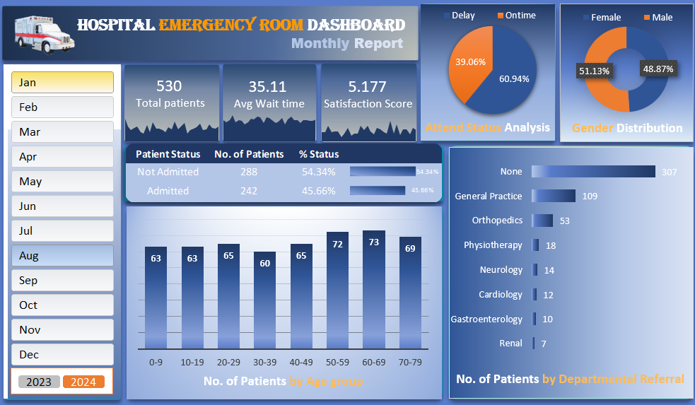

# Hospital-ER-Dashboard-using-Excel

### Dashboard

<p align="center">
  
</p>

---

## Tech Stack

- Microsoft Excel
- Pivot Tables
- Pivot Charts
- Slicers & Timelines
- Conditional Formatting
- Data Cleaning & Transformation
- KPI Dashboard Design

---

## Business Problem Statement
Hospital Emergency Rooms (ERs) operate in a high-pressure environment where patient inflow, treatment timelines, resource allocation, and service quality directly impact patient outcomes and operational efficiency. With thousands of patient visits occurring throughout the year, healthcare administrators often face challenges in monitoring key performance indicators, identifying service bottlenecks, and making timely data-driven decisions.

To address this challenge, an interactive Microsoft Excel Dashboard is required to transform raw ER data into meaningful business intelligence. The dashboard should enable healthcare stakeholders to monitor patient trends, evaluate service efficiency, analyze demographic patterns, and identify opportunities to improve patient experience and operational effectiveness.

## Project Purpose

The available Emergency Room dataset contains approximately 8,000 patient records spanning the years 2023–2024. While the raw data captures valuable information regarding patient demographics, admission status, wait times, referrals, and satisfaction levels, the absence of a centralized analytical solution makes it difficult to derive actionable insights and track operational performance effectively.

The primary objective of this project is to develop an interactive Hospital Emergency Room Analytics Dashboard in Microsoft Excel that provides a comprehensive overview of emergency department performance and patient flow.

The dashboard will empower hospital management, healthcare administrators, and operational teams to:

- Monitor patient volume and visitation trends.
- Measure service efficiency through wait-time analysis.
- Evaluate patient satisfaction levels.
- Analyze patient demographics and admission patterns.
- Identify referral trends across departments.
- Support evidence-based decision-making through interactive reporting.

---

## Business Requirements

The dashboard is designed to answer key business questions:

- **Patient Volume Analysis:** How many patients visit the ER over time?
- **Admission Status:** What proportion of patients are admitted versus discharged?
- **Patient Demographics:** How are patients distributed across age groups and gender?
- **Service Timeliness:** What percentage of patients are attended within 30 minutes?
- **Wait Time Monitoring:** How long do patients wait before receiving medical attention?
- **Patient Satisfaction:** How satisfied are patients with the services received?
- **Department Referrals:** Which departments receive the highest number of referrals?

---

## Dashboard Demonstration

### Interactive Filtering & Data Exploration

The dashboard allows users to filter and analyze Emergency Room performance across different months throughout 2023 and 2024, enabling deeper investigation of patient trends and operational metrics visually.


---

### Dynamic KPI Tracking

Key performance indicators automatically update based on user selections, providing instant insights into patient volume, wait times and satisfaction scores across selected time periods.


---

## Dataset Information

- Source: **[Hospital Emergency Room Dataset](https://github.com/k-sahaj/Hospital-ER-Dashboard-using-Excel/blob/main/Hospital%20Emergency%20Room%20Data.csv)**
- Records: ~8,000 Patients
- Time Period: 2023–2024
- Format: CSV

---

## Key Performance Indicators (KPIs)

| KPI | Business Description |
|------|----------------------|
| **Total Patients** | Tracks the overall number of Emergency Room visits and highlights daily and monthly patient volume trends. |
| **Average Wait Time** | Measures the average time patients wait before receiving medical attention, helping identify operational bottlenecks. |
| **Patient Satisfaction Score** | Evaluates patient experience and service quality based on satisfaction ratings collected during visits. |
| **Admission Rate** | Compares admitted and non-admitted patients to understand hospitalization patterns and resource utilization. |
| **Timeliness Rate (< 30 Minutes)** | Measures the percentage of patients attended within the target response time of 30 minutes. |
| **Department Referral Analysis** | Identifies the most frequently referred departments and helps assess specialist service demand. |
| **Patient Age Distribution** | Analyzes patient volume across different age groups to understand demographic trends. |
| **Gender Distribution** | Examines the distribution of patients by gender to provide demographic insights into ER utilization. |

---

## Key Outcomes

- Consolidated 8,000+ patient records into a single analytical solution
- Improved visibility into Emergency Room operations
- Enabled rapid identification of patient flow patterns and service bottlenecks
- Facilitated data-driven decision-making through interactive reporting
- Delivered an executive-friendly dashboard for performance monitoring

---

## Key Insights

- More than half of patients were attended within the target 30-minute window.
- Adult patients represented the largest share of ER visits.
- Patient satisfaction showed a negative correlation with longer wait times.
- Certain departments received significantly higher referral volumes than others.
- Patient traffic exhibited noticeable monthly fluctuations throughout the year.

---

## Repository Structure

```text
.
├── Dashboard.png
├── Hospital Emergency Room Data.csv
├── GIFs/
│   ├── Slicers.gif
│   └── Interactive_KPI.gif
└── README.md
```

### Dashboard Access

Due to GitHub's file size limitations, the complete Excel dashboard (.xlsx) could not be uploaded to this repository.

A view-only online version of the dashboard is available through Microsoft Excel for the Web:

**[View Excel Dashboard](https://1drv.ms/x/c/4d2acda280e87c5b/IQBn9XFQMEoLQYROGyCUArx2AYmPrXNMxYEgVB09E2n5MaU?e=QcdZDw)**

---

## Author

**Sahaj K.**
